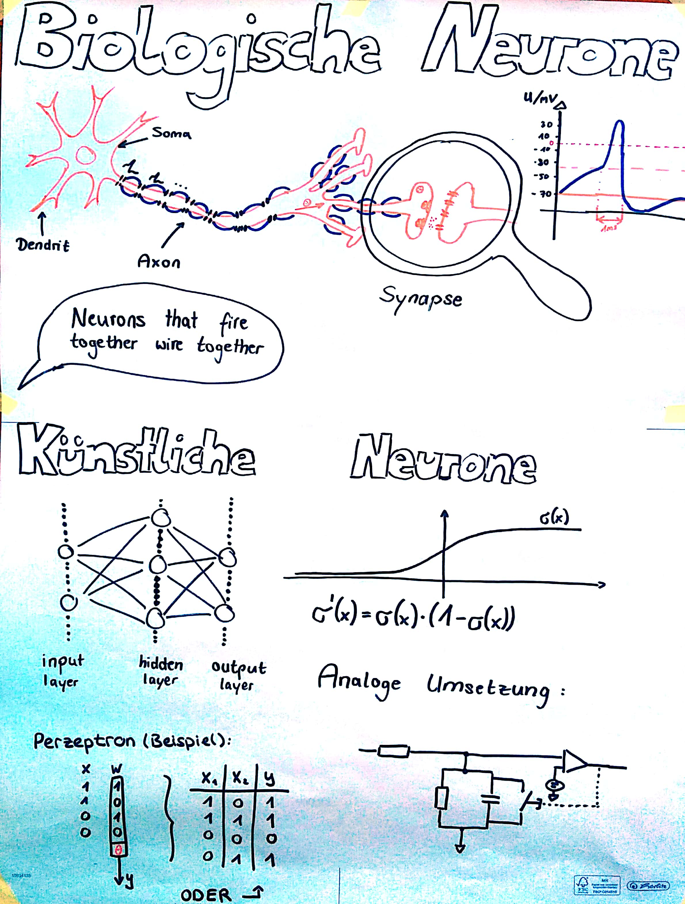
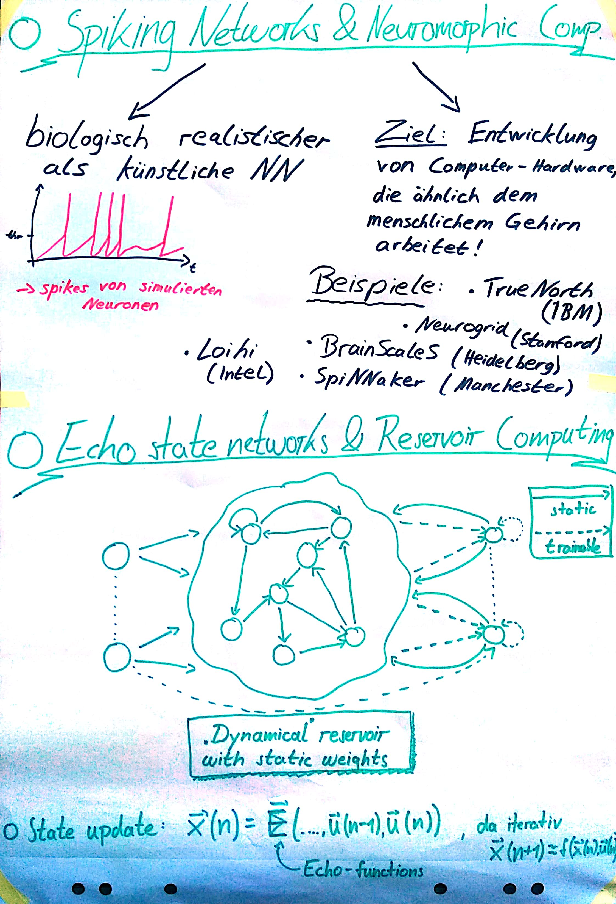
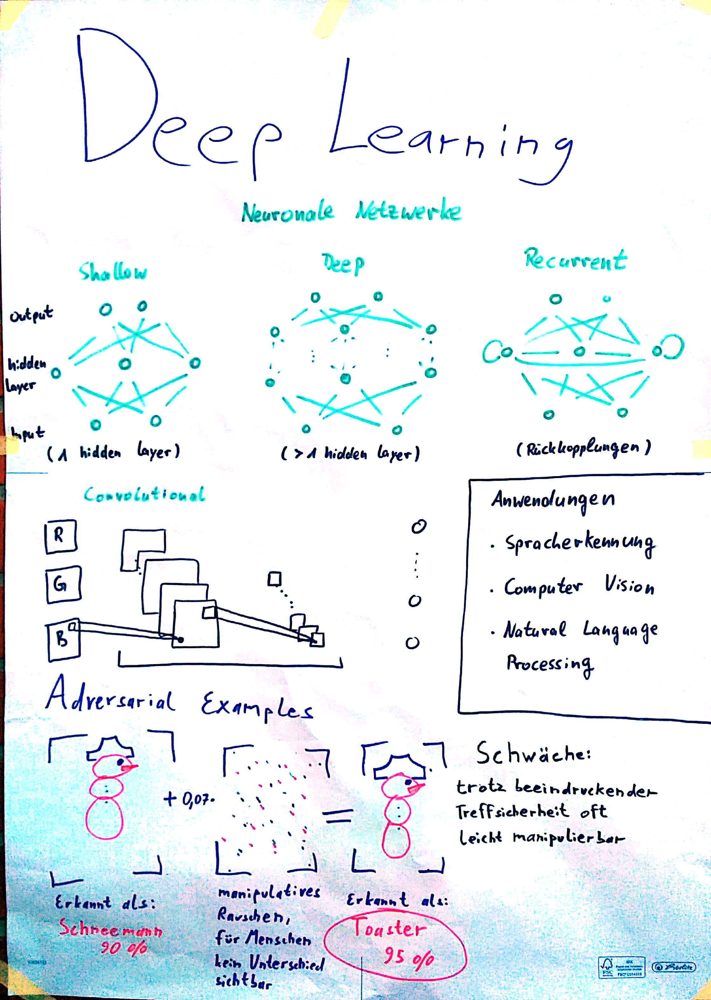
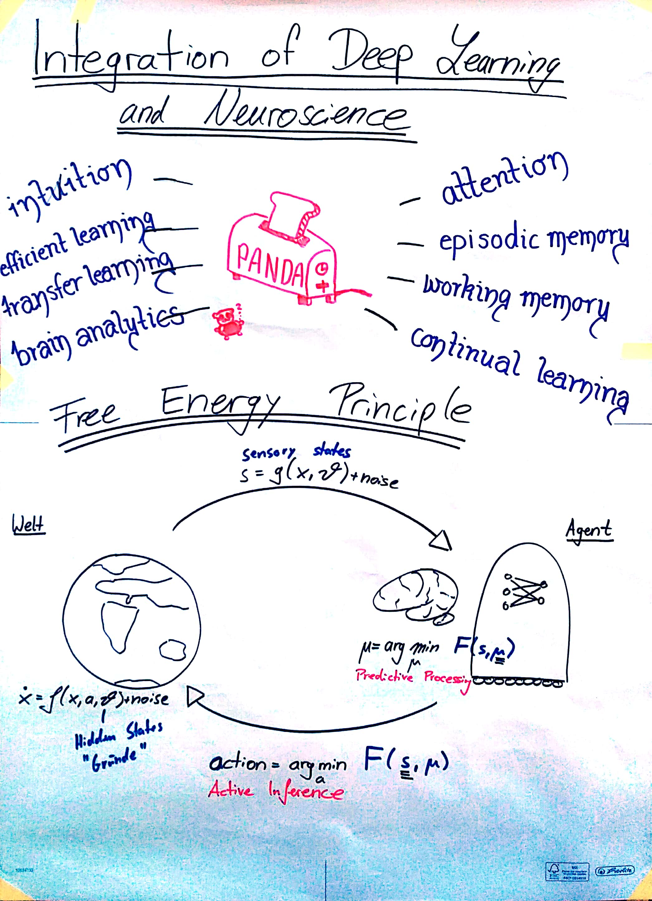

# Learning in Brains and Machines
Workshop at CdE Pfingstakademie, Mai 18 - 21, 2018

## About the Course

Das Forschungsfeld der Künstlichen Intelligenz hat durch das Trainieren von tiefen künstlichen neuronalen Netzen auf großen Datensätzen in den letzten Jahren einen massiven Aufschwung erlebt.
Die Idee hinter solchen Algorithmen ist nicht neu: Schon in den 1950ern Jahren kamen erste Ideen zum Bau komplexer, lernfähiger Algorithmen aus "künstlichen Neuronen" zustande, vor allem motiviert durch Fortschritte in den Neurowissenschaften. Ungeachtet dieser initialen Motivation haben sich beide Felder thematisch aktuell wieder voneinander entfernt.

Unser Kurs wird ein "Journal Club", bei dem jeder die Möglichkeit erhält, sich mit einem Teilaspekt aus den Neurowissenschaften, Machine Learning und Statistischer Lerntheorie im Vorfeld näher auseinanderzusetzen.
Am Besten funktioniert das in einer diversen Gruppe, daher solltet ihr entweder Vorkenntnisse in Mathematik, Physik, Informatik oder Machine Learning mitbringen, oder aber biologisches und medizinisches Vorwissen aus Neurowissenschaften, Physiologie des Gehirns oder Neurologie haben. Programmiererfahrung in Matlab oder Python ist ein Plus, weil wir ggf. ein paar Beispiele implementieren werden!
Ziel ist es, der Frage auf den Grund zu gehen, mit welchen Lernalgorithmen biologische Gehirne arbeiten und welche Gemeinsamkeiten es zu aktuellen Ansätzen im Machine Learning gibt.

## Workshop Day 1 - Saturday, Mai 19

### Session 1: Einführung in Künstliche und Biologische Neuronen

  - Artificial and Biological Neurons
  - Hodkin-Huxley, Leaky Integrate and Fire, Izhikevich Models
  - A simple artificial neural network: The Perceptron algorithm

### Session 2: Lernregeln in Biologischen und Künstlichen Neuronalen Netzen

- Backpropagation [Hinton1986]
- Spike Time Dependent Plasticity (STDP)

### Session 3: Reservoir Computing, Spiking Neural Networks, Echo-State-Machines

- Echo State Machines [Jaeger2010]
- Introduction to Neuromorphic Computing

### Session 4: Deep Learning

- Overview of Deep Learning [LeCun2015]
- Gaps between Brains and Machines: Adversarial Examples [Papernot2016]

### Session 5, Part I: Integration of Deep Learning and Neuroscience?

- Toward an Integration of Deep Learning and Neuroscience [Marblestone2016]
- Deep Neural Networks: A New Framework for Modeling Biological Vision and Brain Information Processing [Kriegeskorte2015]

### Hands-On Session

- Introduction to Machine Learning Techniques and Concepts: [Machine Learning Notebook](https://github.com/stes/learning-in-brains-and-machines/blob/master/Machine%20Learning%20Intro.ipynb)
- Introduction to Deep Learning with PyTorch: [Deep learning notebook](https://github.com/stes/learning-in-brains-and-machines/blob/master/Neural%20Networks.ipynb)
- Introduction to Neuron Models: [Neuron Model Notebook](https://github.com/stes/learning-in-brains-and-machines/blob/master/Izhikevich%20Neuron%20Model.ipynb)

## Workshop Day 2 - Sunday, Mai 20

### Session 5, Part II: Integration of Deep Learning and Neuroscience? Diskussion.

- Toward an Integration of Deep Learning and Neuroscience [Marblestone2016]
- Deep Neural Networks: A New Framework for Modeling Biological Vision and Brain Information Processing [Kriegeskorte2015]

### Session 6: Predictive Processing - The Bayesian Brain?

- The free-energy principle: a unified brain theory? [Friston2010]
- Chapter 10: Approximate Inference [Bishop2006]

## Kursdoku

In unserem Kurs haben wir uns mit der Geschichte von Maschinellem Lernen
und Neurowissenschaften beschäftigt, von gemeinsamen Anfängen und
Ansätzen in den 1950er Jahren bis hin zu aktuellen Bestrebungen, beide
Forschungsfelder zu vereinen und Synergien zu entwickeln. Alle
Teilnehmerinnen und Teilnehmer haben daher ein Referat zu verschiedenen
Themen vorbereitet, das in der Gruppe anschließend diskutiert wurde. Ein
paar ausgewählte Themen haben Sophia, Bernd und Lucas im Folgenden
zusammengestellt.

### Künstliche Neuronen

Eine der großen Fragen in der Geschichte der Menschheit ist: Wie denken
wir? Und wie funktioniert unser Gehirn? Aus diesem Interesse und der
Forschung an biologischen Neuronen entwickelte sich die Idee der
künstlichen Intelligenz. Dazu sollte das menschliche Gehirn mit all
seinen unglaublichen Fähigkeiten zum Vorbild genommen werden. 1943
entwickelten die Mathematiker Walter Pitts und Warren McCulloch das
erste künstliche Neuron als Schwellenwertelement mit mehreren Inputs und
einem Output. Die Entscheidungen dieses Neuron wurden nach dem
Aktionspotential einer Nervenzelle im menschlichen Gehirn erschaffen.
Durch Kombination dieser Neuronen konnten Wissenschaftler nun einfache
Schaltungen wie UND, ODER und NICHT darstellen. Dies löste einen
allgemeinen "Hype" unter den derzeitigen Wissenschaftlern aus, da man
damals bereits davon ausging, dass eine KI, die reden, laufen, sehen und
denken konnte, in naher Zukunft läge. Dies hat sich allerdings nach
wenigen Jahren widerlegen lassen, da die möglichen Schaltungen, die
durch die Neuronen erschaffen werden konnten, bei weitem nicht für eine
solche KI ausreichten. 1957 entwickelte Frank Rosenblatt dann den
sogenannten Perzeptron Algorithmus, der für die Bilderkennung genutzt
werden sollte und auch heute noch als ein grundlegender Meilenstein
gesehen wird. Ein Perzeptron ist eine Verknüpfung mehrerer (künstlicher)
Neuronen, die zusammen über einen Schwellenwert entscheiden, wie die
gegebene Eingabe zu klassifizieren ist. Dazu kommt noch, dass sich der
Algorithmus mit sog. Lernregeln selbstständig verbessern kann.

Der Schritt zur allgemeinen künstlichen Intelligenz scheint zwar selbst
heute noch groß zu sein, doch bereits vor einem halben Jahrhundert sind
die Grundlagen gesetzt worden und sowohl die Hardware als auch die
Software haben sich seitdem immens verbessert und damit auch die
Möglichkeiten aller Entwickler und Wissenschaftler.

Session 1 und 2             |  Session 3
:-------------------------:|:-------------------------:
 | 

### Von Informationstheorie zum "Bayesian Brain"

Für eine gegebene, diskrete Wahrscheinlichkeitsverteilung
$(p_i)_{i \in I}$ ist die Shannon-Entropie wie folgt (in die Einheit
‚Bit') wie folgt definiert:
$$H ( (p_i)_{i \in I} ) := -\sum_{i \in I} p_i \log_2 (p_i).$$

Die Einheit (hier in Bit) ergibt sich aus der Basis des verwendeten
Logarithmus. Die Shannon-Entropie kann als Erwartungswert des
Informationsgehaltes interpretiert werden. Der Informationsgehaltes
eines Ereignisses mit Wahrscheinlichkeit p ist eine positive, monoton
fallende Funktion $p \mapsto -\log_2(p)$ Je öfters ein Ereignis
eintritt, desto geringer ist der Informationsgehalt, den man daraus
ziehen kann. Die $-\log(\cdot)$ Funktion ist dabei die einzig zulässige
Funktion, die gewisse Eigenschaften erfüllt. Dies spielt auch bei der
Kodierung von Nachrichten ein Rolle: Will man jeden Buchstaben des
Alphabets durch 0-1-Folgen kodieren, so ist die beste Strategie um
möglichst wenig Zeichen zu benutzen die, dass man selten vorkommenden
Buchstaben des Alphabets eine längere Code-Länge zuweist als häufigen
Buchstaben. Die Shannon-Entropie ist demnach die mittlere Code-Länge,
die man braucht, um ein Ereignis (oder einen Buchstaben) zu kodieren.

Die Grundidee des "Free-Energy-Principles" (nach Karl Friston) ist es,
die freie Energie des Systems zu minimieren. Die freie Energie ist (in
Anlehnung an die Thermodynamik) definiert als die Differenz zwischen
Energie und Entropie.

Laut Friston's Theorie lassen sich sowohl unsere Wahrnehmungen als auch
unsere Handlungen auf dieses Prinzip zurückführen, in Form von zwei
Abläufen, die als "Predictive Processing" und "Active Inference"
bezeichnet werden:

Beim "Predictive Processing" wird freie (informationstheoretische)
Energie minimiert, indem eintreffende Sensorinformationen so
interpretiert werden, wie es unter dem eigenen Weltbild aktuell am
plausibelsten erscheint. Unser Handeln hingegen wird durch die aktive
Inferenz bestimmt, die nach dem gleichen Prinzip freie Energie
minimiert, indem wir stets diejenige Handlung vollführen, die unsere
Unsicherheit, und unseren Fehler zwischen Erwartung und wahrgenommener
Realität am besten minimiert. In seiner formalen Form bietet das Free
Energy Principle damit eine interessante Möglichkeit, beide Aspekte als
ein gemeinsames Optimierungsproblem aufzufassen, dass das Gehirn löst.

### Zwischen Neuroscience und KI: Neuromorphic Computing 

Moore's Law besagt, dass sich circa alle 2 Jahre die Anzahl der
Transistoren, die auf einem Computerchip Platz haben, verdoppelt und
somit auch die Computerleistung. Jedoch gibt es physikalische Grenzen
und es wird erwartet, dass wir bald an das Ende des Möglichen stoßen.
Daher wird bereits nach alternativen Lösungen gesucht, um Computer
leistungsfähiger zu machen.

Ein Ansatz ist die Erforschung von Quantencomputer, während ein anderer
sich auf das sogenannte Neuromorphic Computing konzentriert. Dies zielt
darauf ab, die Art und Weise, wie das Gehirn arbeitet, nachzuahmen und
dadurch Computerarchitekturen zu entwickeln, die von Nervenzellen oder
Neuronen inspiriert sind. Daher eignet sich neuromorphe Hardware zum
Beispiel auch, um Spiking Neural Networks, also Modelle echter
neuronaler Netze, zu simulieren.

Die Idee dahinter, das Nervensystem nachzuahmen, kommt daher, dass auch
das Gehirn als eine Art von Supercomputer angesehen werden kann, der
mehrere Millionen Berechnungen pro Sekunde anstellen kann. Der große
Unterschied zu unseren bestehenden Supercomputern ist jedoch, dass das
Gehirn nur einen winzigen Bruchteil an Energie verbraucht und daher viel
effizienter arbeitet. Weitere Vorteile zu herkömmlichen
Computerarchitekturen sind die Parallelität, real-time Berechnungen,
Fehlertoleranz, Robustheit, online learning und die gute Anwendbarkeit
in den Neurowissenschaften.

**Session 4**            |  **Session 5 und 6**
:-------------------------:|:-------------------------:
 | 

Es wird erwartet, dass der Markt von neuromorpher Hardware im Jahre 2025
bereits 2 Milliarden € Wert sein wird, was vor allem auch an dem
gesteigerten Interesse in Künstliche Intelligenz liegt, die auf dieser
speziellen Hardware schneller und energieeffizienter umgesetzt werden
kann. Das Forschungsfeld selbst ist sehr interdisziplinär und erfordert
z.B. Expertise aus den Gebieten der Biologie, Physik, Mathematik,
Informatik und Elektrotechnik.

Es gibt zwei grundlegende Ansätze, neuromorphe Hardware zu bauen. Die
erste Möglichkeit ist, sie mit digitaler Technologie zu entwickeln, was
dazu führt, dass die Neuronen-Modelle in Software simuliert werden und
ähnlich zu klassischen Computern einfach programmiert werden können. Die
andere Möglichkeit basiert auf analogen Schaltkreisen. Hier werden
Neuronen direkt durch Elektronikkomponenten modelliert und sind daher
ähnlicher dem biologischen Vorbild. Der Nachteil hier ist die
umständliche Programmierung und dass analoge Systeme durch andere
Einflüsse beeinträchtigt werden könne. Ein weiterer Ansatz ist, analoge
und digitale Bausteine kombinieren, um sogenannte Mixed-Signal Systeme
zu bauen und dadurch von den Vorteilen von beiden zu profitieren.

Im Folgenden werden die wichtigsten neuromorphen Hardwarearchitekturen
vorgestellt und dabei etwas auf die Unterschiede eingegangen. Alle haben
ihre eigenen Vor- und Nachteile wie beispielsweise Energieeffizienz,
Flexibilität, Konfiguration oder Integration.

Zuerst werden zwei analoge Systeme präsentiert. Das „Neurogrid" System
wurde an der Universität von Stanford entwickelt und bildet Neuronen in
analogen Schaltkreisen ab, während die eigentliche Spike-Kommunikation
digital implementiert wurde. Ein einzelnes Board besteht aus 16 Chips,
die jeweils 65.536 analoge Neuronen enthalten. Es wird zum Beispiel für
Prothesen oder Drohnen eingesetzt. Die „BrainScaleS" Hardware von der
Universität Heidelberg, die mittlerweile im Zuge des Human Brain
Projects (HBP) der EU genutzt wird, implementiert analoge neuronale
Schaltkreise, die 10.000-mal schneller als das biologische Vorbild
arbeiten. Daher wird es vor allem für Anwendungen benutzt, die in der
Realität sehr lange dauern, wie zum Beispiel für das Verständnis von
long-term learning in biologischen Systemen.

Eine digitale Hardware ist das „TrueNorth" System von IBM, das auf
verteilten digitalen Neuronen-Modellen für real-time kognitive
Anwendungen basiert. Es ist das Ergebnis von 10 Jahren Arbeit im DARPA
(Defense Advanced Research Projects Agency) SYNAPSE Projekt. TrueNorth
ist komplett digital und asynchron und die Hardware verhält sich
deterministisch. Ein einzelner CMOS Chip enthält 5.4 Millionen
Transistoren mit 4096 neurosynaptischen Kernen. Es gibt die Möglichkeit,
mehrere Boards aneinanderzuhängen, um durch die gewonnene Kapazität
größere Simulationen laufen zu lassen. Einsatzgebiete für TrueNorth sind
beispielsweise Sensorfusion oder Objekterkennung in Echtzeit.

Ein weitere digitale neuromorphe Entwicklung ist „SpiNNaker" (Spiking
Neural Network Architecture) von der Universität Manchester. SpiNNaker
implementiert Neuronen und Synapsen in Software auf kleinen
eingebetteten ARM-Prozessoren. Eine große Stärke ist die massive
Parallelität. In Manchester selbst steht eine Maschine mit 1 Millionen
Kernen, die vom HBP benutzt wird und auf der 1% des menschlichen Gehirns
simuliert werden kann. SpiNNaker wird vor allem dazu benutzt, neuronale
Netzwerke zu simulieren.

Ein Chip, der Anfang 2018 vorgestellt wurde, ist „Loihi" von Intel.
Dieser ist lernfähig und enthält 130.000 Neuronen sowie 130 Millionen
Synapsen. Er funktioniert komplett asynchron, basiert auf der 14nm
Technologie von Intel und es wird erwartet, dass zum Beispiel Machine
Learning Aufgaben schneller und energieeffizienter darauf ausgeführt
werden können. Der Chip ist als Forschungschip gedacht und wird in
nächster Zeit mit führenden Universitäten und Forschungseinrichtungen
geteilt.

### Abschließendes

Unsere Kurswebseite wird auch nach der Pfingstakademie auf
[stes.io/learning-in-brains-and-machines](http://stes.io/learning-in-brains-and-machines)
erreichbar sein.

*Texte von Sophia, Lucas und Bernd. Editiert von Simon und Steffen.*

## Contact

If you have any questions about the material for this course, do not hesitate to [contact me](http://stes.io).
